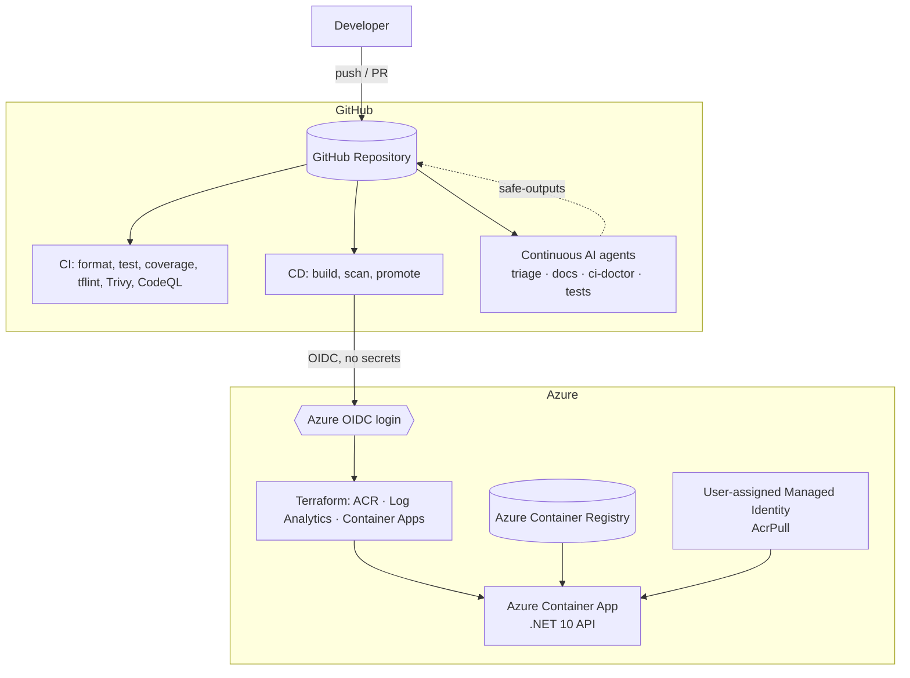
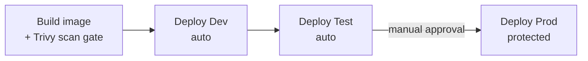

# Agentic DevOps on GitHub — Continuous AI PoC

A proof-of-concept that showcases **the best of agentic DevOps on GitHub**: a real
application that ships to Azure through a secure, multi-environment pipeline, with
[GitHub **Continuous AI**](https://githubnext.com/projects/continuous-ai/) agents
automating triage, documentation, diagnostics, and test improvement.

> **Continuous AI** is to collaborative software what CI/CD is to builds and
> deployments: routine, automated, AI-assisted work that runs *continuously* in the
> background of your repository. This repo demonstrates that vision end-to-end.

---

## What this demonstrates

| Capability | How it's shown here |
| --- | --- |
| **Ships to Azure** | .NET 10 minimal API → container → **Azure Container Apps** via **Terraform** |
| **Secure by default** | GitHub **OIDC** (no cloud secrets), managed identity, ACR without admin creds |
| **Quality gates** | `dotnet format`, xUnit tests, **60% coverage gate**, `tflint`, `actionlint`, `markdownlint` |
| **DevSecOps scanning** | **Trivy** (filesystem, IaC config, container image) + **CodeQL** + **Dependabot** |
| **Multi-environment** | **Dev → Test → Prod** promotion with manual approval before production |
| **Continuous AI** | Four agentic workflows ([gh-aw](https://github.com/githubnext/gh-aw)) running on GitHub Copilot |

---

## Continuous AI agents

These live as Markdown in [.github/workflows/](.github/workflows/) and compile to
locked GitHub Actions (`*.lock.yml`) via `gh aw compile`. They use **safe-outputs**
— the agent never gets write tokens directly; its proposed actions (labels,
comments, PRs, issues) are applied by a separate, minimally-scoped job.

| Agent | File | Trigger | Continuous AI pillar |
| --- | --- | --- | --- |
| **Issue Triage** | [issue-triage.md](.github/workflows/issue-triage.md) | Issue opened/reopened | Continuous Triage |
| **Doc Updater** | [doc-updater.md](.github/workflows/doc-updater.md) | Push to `main` | Continuous Documentation |
| **CI Doctor** | [ci-doctor.md](.github/workflows/ci-doctor.md) | CI/CD run fails | Continuous Repair |
| **Test Improver** | [test-improver.md](.github/workflows/test-improver.md) | Weekly + manual | Continuous Quality |

The engine is **GitHub Copilot**, so no third-party model API keys are required.

---

## Architecture



### Environment promotion



Each environment is fully isolated: its own resource group, ACR, Container Apps
environment, managed identity, and Terraform state file.

---

## Repository layout

```text
.
├── src/Api/                 # .NET 10 minimal API (Task CRUD) + Dockerfile
├── tests/Api.Tests/         # xUnit unit + integration tests
├── infra/                   # Terraform for Azure Container Apps (multi-env)
│   ├── envs/                # dev/test/prod tfvars + backend configs
│   └── bootstrap/           # remote state + GitHub OIDC identities (run once)
├── .github/
│   ├── workflows/           # CI, CD, CodeQL + agentic (*.md → *.lock.yml)
│   └── dependabot.yml
├── AgenticDevOps.sln
└── README.md
```

---

## The application

A small **Task API** (in-memory store) that is realistic enough to exercise the
whole pipeline:

| Method | Route | Description |
| --- | --- | --- |
| `GET` | `/healthz` | Liveness/readiness probe |
| `GET` | `/tasks` | List tasks |
| `GET` | `/tasks/{id}` | Get a task |
| `POST` | `/tasks` | Create a task |
| `PUT` | `/tasks/{id}` | Update a task |
| `DELETE` | `/tasks/{id}` | Delete a task |

OpenAPI is exposed at `/openapi/v1.json` in Development.

---

## Run locally

Prerequisites: **.NET 10 SDK** (see [global.json](global.json)).

```pwsh
dotnet restore AgenticDevOps.sln
dotnet test AgenticDevOps.sln -c Release --settings coverlet.runsettings
dotnet run --project src/Api
```

> On corporate machines with a restricted global NuGet feed, add
> `--configfile nuget.config` to the restore command to force nuget.org.

---

## Deploy to Azure

Deployment is OIDC-based and runs from GitHub Actions — there are **no cloud
secrets** stored in the repo. See [docs/SETUP.md](docs/SETUP.md) for the full
one-time setup (bootstrap state + OIDC identities, GitHub Environments, and
variables). In short:

1. `terraform -chdir=infra/bootstrap apply` — creates the Terraform state account
   and one GitHub-federated managed identity per environment.
2. Configure GitHub **Environments** (`dev`, `test`, `prod`) and set the
   `AZURE_CLIENT_ID` / `AZURE_TENANT_ID` / `AZURE_SUBSCRIPTION_ID` /
   `STATE_STORAGE_ACCOUNT` variables. Add required reviewers to `prod`.
3. Push to `main` — **CD** builds, scans, and promotes Dev → Test → Prod.

---

## Security posture

- **No long-lived cloud credentials** — GitHub OIDC federation only.
- **No ACR admin user** — image pulls use a user-assigned managed identity with
  `AcrPull`.
- **Defense-in-depth scanning** — Trivy (deps, IaC, image) + CodeQL, all reported
  as SARIF to GitHub code scanning; CRITICAL/HIGH findings fail the build.
- **Least-privilege agents** — Continuous AI workflows read-only by default;
  mutations go through scoped **safe-outputs** jobs.

See [SECURITY.md](SECURITY.md) for details.
